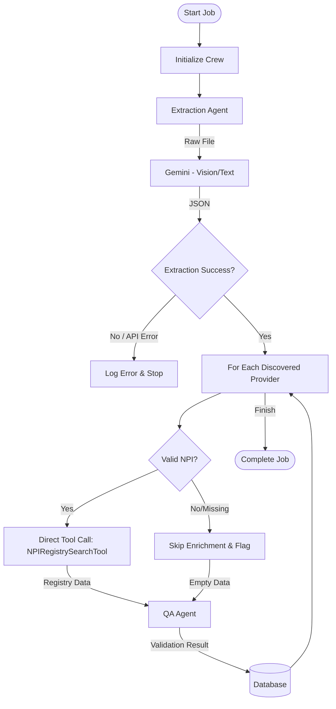

# Orchestration Logic (CrewAI + Deterministic Tools)

The AVE utilizes a hybrid approach, combining **CrewAI agents** for complex reasoning (Extraction, QA) with **deterministic Python logic** for strict data retrieval (Enrichment). This ensures reliability where precision is paramount and flexibility where AI reasoning is needed.

## 🧠 The Hybrid Workflow

The `run_validation_crew` function in `app/crew/crew.py` orchestrates the sequential pipeline. It manages state, progress tracking, and error recovery.

---

## 🕵️‍♂️ Key Components

### 1. The Controller (`run_validation_crew`)
Located in `app/crew/crew.py`. It is the entry point that:
- Initializes the database session.
- Creates a temporary file for processing.
- Manages the **Progress Loop**, updating the job status in real-time.
- Handles **Cancellation** requests between steps.

### 2. Step 1: Extraction (`extraction_agent`)
- **Role**: The Parser.
- **Mechanism**: **AI Agent (CrewAI)**.
- **Model**: `gemini-2.5-flash` (or configured model).
- **Behavior**:
    - Analyzes the uploaded file (PDF, Image, CSV) using Gemini's multimodal capabilities.
    - Extracts structured data: Name, NPI, Specialty, Address, License.
    - **Error Handling**: Catches `429 Quota Exceeded` errors and logs them prominently.

### 3. Step 2: Enrichment (Direct Tool Call)
- **Role**: The Researcher.
- **Mechanism**: **Deterministic Python Function**.
- **Change**: *Previously an AI Agent, now a direct tool call to prevent hallucinations and hangs.*
- **Behavior**:
    - **Validation**: Checks if a valid NPI exists (length > 5, not null).
    - **Lookup**: Directly instantiates `NPIRegistrySearchTool` and calls the NPPES API.
    - **Outcome**: Returns exact registry data or marks as "Not Found" without AI "thinking" time. This ensures 0% hallucination rate for registry data.

### 4. Step 3: Quality Assurance (`qa_agent`)
- **Role**: The Judge.
- **Mechanism**: **AI Agent (CrewAI)**.
- **Model**: `gemini-2.5-flash`.
- **Behavior**:
    - Receives `Extracted Data` (from Step 1) and `Registry Data` (from Step 2).
    - Performs a logical comparison of fields.
    - assigns a **Confidence Score** (0-100) and **Status** (Validated/Flagged).
    - Generates a list of **Discrepancies** with specific penalties.

---

## 🛡️ Error Handling & Resiliency

The orchestration layer includes specific safeguards:

1.  **Strict NPI Validation**:
    - If an NPI is missing or looks like a placeholder, the system skips the external API call entirely to prevent timeouts.

2.  **API Quota Protection**:
    - If Gemini returns a `429` error, the system catches it immediately.
    - Logs a `🚫 GEMINI API QUOTA EXCEEDED` error to the live execution stream.

3.  **Graceful Cancellation**:
    - The loop checks `is_job_cancelled(job_id)` before processing **every single provider**.
    - If a user clicks "Stop", the process halts immediately after the current step.

4.  **Batch Rate Limiting**:
    - A 5-second `time.sleep` is enforcing between providers to respect external API rate limits and prevent 429s.
